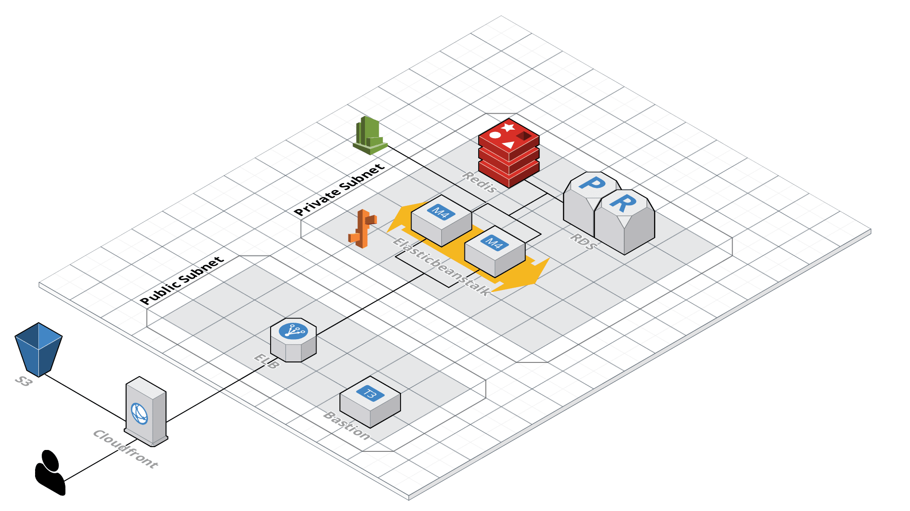
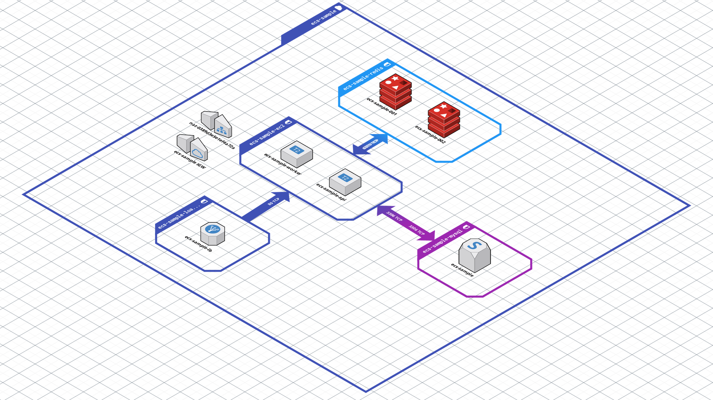

# Overview
This is repo for cloudfront template for reuse purpose

## Elasticbeanstalk 
This was used to create "Cream" app.

follow instruction to create eb app. 
[EB instruction](elasticbeanstalk/README.md)

## ECS-Sample 
This was used to for demonstration of `staging` environment setup.

Refer to the repo and blog post.
[ecs-sample repo](https://github.com/kokospapa8/ecs-fargate-sample-app)
